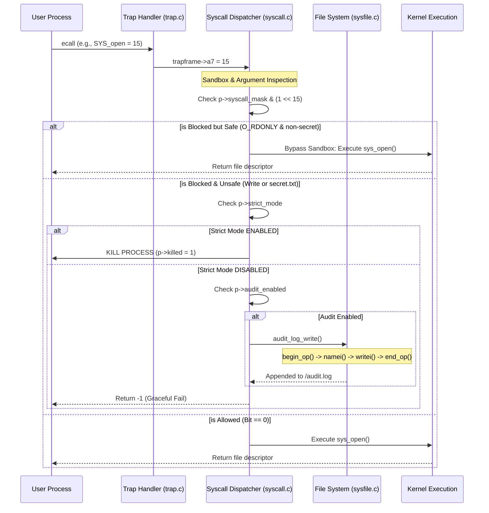
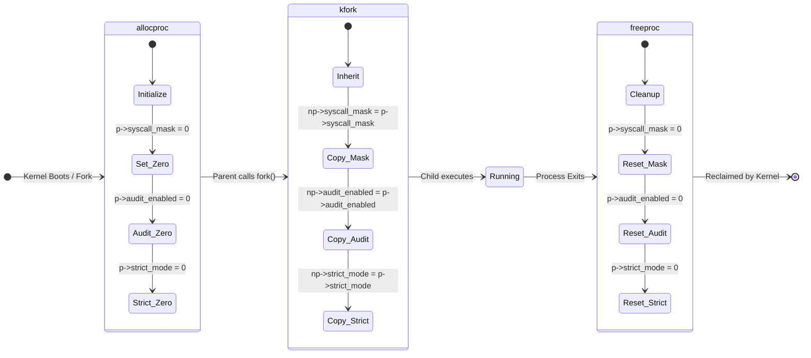

# xv6 Syscall Filter (Sandbox OS)

An advanced, highly secure system call filtering mechanism (Sandbox) implemented within the **xv6-riscv** operating system. This project allows user-space programs to restrict their own privileges dynamically, preventing malicious or compromised code from executing unauthorized system calls.

---

## 🌟 Key Features

1. **Bitmasking Architecture**: Filters are encoded into a highly efficient 64-bit integer mask, ensuring $O(1)$ performance penalty for syscall interception.
2. **Default-Allow (Blacklist) Policy**: Prioritizes OS stability. Syscalls are permitted by default unless explicitly restricted.
3. **Policy C (Additive-Only Ratchet)**: To prevent sandbox escape, a process can only *tighten* its restrictions. Once a syscall is blocked, it can **never** be unblocked.
4. **State Inheritance**: Child processes spawned via `fork()` strictly inherit the sandbox constraints of their parent.
5. **Zero Memory Leakage**: Guaranteed cleanup of process states during `allocproc` and `freeproc`.
6. **Audit Logging**: A dedicated syscall (`SYS_setaudit`) allows the kernel to alert system administrators when a process attempts to violate its sandbox constraints.
7. **Deep Argument Filtering**: Intercepts `SYS_open` arguments directly from registers `a0`/`a1`. Intelligently bypasses the sandbox for safe, read-only file accesses (`O_RDONLY`) while blocking malicious paths.
8. **Persistent FS Logging**: Audit logs are securely written to `/audit.log` via deep kernel-level file operations (`begin_op`, `writei`) without risking system deadlocks.

---

## 🛠️ The Sandbox API (User-Space)

We provide a clean, polished, and intuitive C library (`user/filter.h`) for developers to easily sandbox their applications.

```c
#include "user/filter.h"

// 1. Block a specific system call (e.g., prevent file opening)
sandbox_block_syscall(SYS_open);

// 2. Enable Audit Logging (Prints to Kernel Console upon violation)
sandbox_set_audit(1);

// 3. Apply a custom bitmask directly
sandbox_set_mask(SANDBOX_BLOCK(SYS_write) | SANDBOX_BLOCK(SYS_exec));
```

---

## 🚀 How to Build and Run

### 1. Compilation
Make sure you have the RISC-V toolchain installed. Run the following command to compile the OS and launch QEMU:
```bash
make qemu
```

### 2. Available Test Suites
Once inside the xv6 shell, you can run the following built-in test programs:

*   **`sandboxdemo`**: An interactive demonstration showing a child process successfully sandboxing itself and triggering the Audit Logger when attempting to call `open()`.
*   **`stresstest`**: A rigorous stability test that floods the kernel with 10,000 recursive `fork()` and syscall filtering requests to ensure zero memory leaks.
*   **`scenariotest`**: Simulates a real-world scenario where a restricted shell attempts to execute `cat secret.txt` but is intercepted by the Sandbox.
*   **`filtertest`**: The core unit test suite verifying the integrity of the Additive-Only Ratchet policy and inheritance rules.

---

## 📊 System Architecture

### Syscall Interception & Audit Workflow
When a user program executes an `ecall`, the Trap Handler forwards it to the Syscall Dispatcher. The dispatcher performs a $O(1)$ Bitmask check and a Deep Argument Inspection. If blocked and deemed unsafe, it triggers the Persistent FS Logger before returning a Graceful Fail (`-1`).



### Security State Machine
During the `allocproc -> kfork -> freeproc` lifecycle, the kernel guarantees that all security masks (`syscall_mask` and `audit_enabled`) are zero-initialized, deeply copied during fork, and cleanly wiped upon process termination.



---
