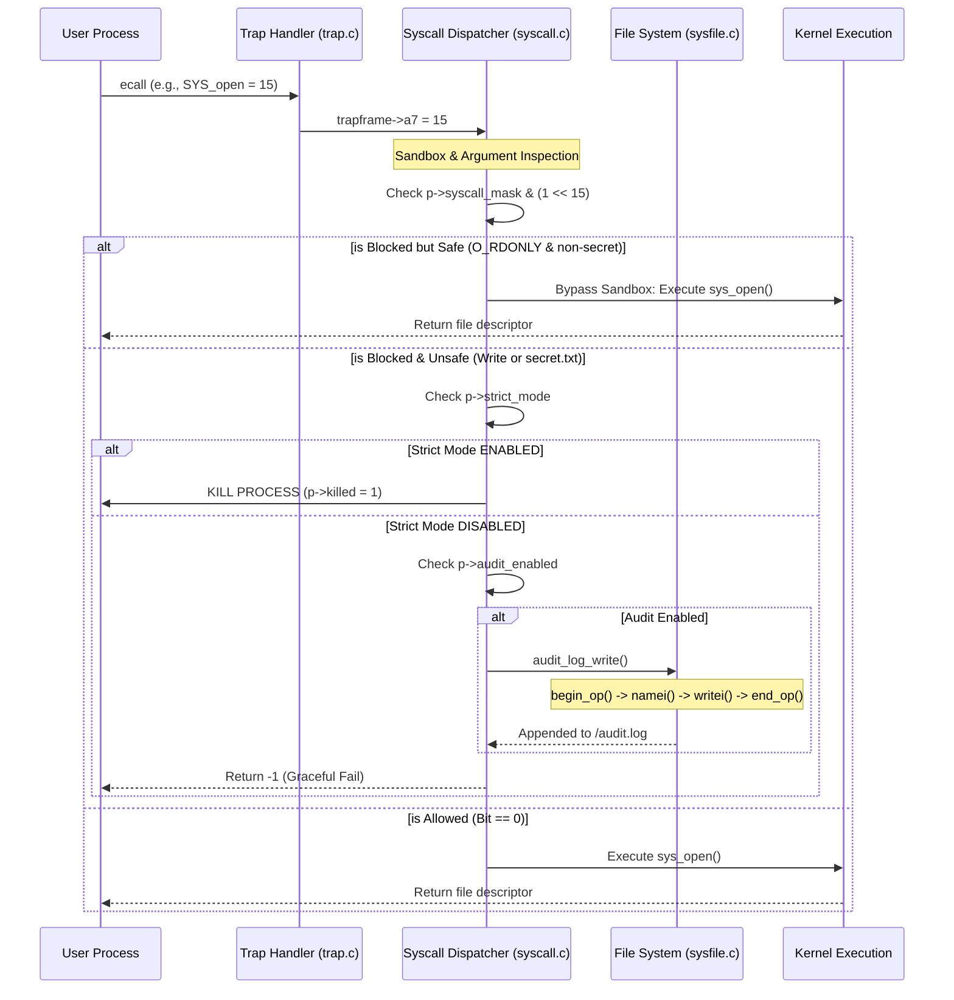
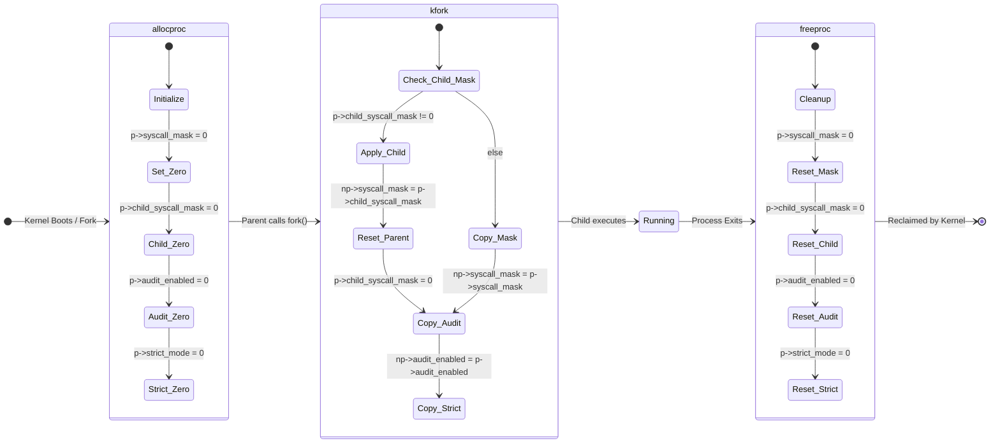

# 🛡️ xv6-syscall-filter (Sandbox OS)

**An Advanced Active Defense Kernel Extension for xv6-riscv**

This project introduces a highly efficient, $O(1)$ latency **Sandbox Architecture** directly into the xv6-riscv kernel. It provides proactive security mechanisms, process isolation, and atomic file-system auditing to mitigate privilege escalation and real-world vulnerabilities (like Buffer Overflows).

---

## 🌟 Core Architecture & Features

### 1. $\mathcal{O}(1)$ Bitmask Filtering
Instead of expensive string-based ACLs, the kernel leverages a 64-bit integer mask embedded in the Process Control Block (`struct proc`). System call verification is performed in a single hardware-level bitwise `AND` operation, ensuring **zero overhead latency** during syscall dispatch.

### 2. Dual-Mask Architecture & Inheritance
A parent process can establish a secure perimeter for a child process *before* it is created using `sandbox_set_child_mask()`. When `fork()` is called, the child inherits the restricted mask, while the parent retains 100% of its original privileges.

### 3. Additive-Only Ratchet Policy
To prevent malicious privilege escalation, the kernel enforces a strict one-way ratchet policy. Once a system call is blocked via `setfilter()`, it can **never** be unblocked. Any attempt to weaken the sandbox is rejected mathematically at the kernel level.

### 4. Deep Argument Inspection (Host Intrusion Prevention System - HIPS)
The sandbox bypasses shallow syscall interception to inspect actual register arguments (e.g., `a0`, `a1`), acting as a full-fledged HIPS:
- **`SYS_kill` (Anti-Assassination):** Protects core system processes (PID 1 `init` and PID 2 `shell`) from being killed by malware.
- **`SYS_exec` (RCE Prevention):** Inspects execution paths. Automatically blocks attempts to execute terminal shells (`sh`) or destructive commands (`rm`), preventing Remote Code Execution.
- **`SYS_unlink` (System Integrity):** Protects critical system directories (e.g., `/bin/`) and files (e.g., `README`) from Ransomware/Wiper deletion attempts.
- **`SYS_sbrk` (DoS Mitigation):** Enforces Resource Quotas by preventing a sandboxed process from allocating excessive memory (>1MB per request or >10MB total), mitigating local Denial of Service attacks.
- **`SYS_open` (Access Control):** Dynamically allows safe read-only operations while blocking attempts to access restricted paths like `secret.txt`.

### 5. Strict Mode (Kill-on-Violation)
Simulates a real-world server defense (Master-Worker architecture). If a worker process is compromised (e.g., via Buffer Overflow) and attempts to execute a malicious shellcode (`exec`), the Kernel immediately intercepts and terminates the process (`p->killed = 1`), saving the host machine.

### 6. Atomic File System Auditing
All sandbox violations are persistently logged directly to the hard drive (`/audit.log`). Bypassing user-space tampering, the Kernel opens an **Atomic FS Transaction** (`begin_op`, `writei`) to safely and consistently record the exact PID and Syscall number of the attacker.

---

## 📊 System Architecture Diagrams

### Syscall Interception & Audit Workflow
When a user program executes an `ecall`, the Trap Handler forwards it to the Syscall Dispatcher. The dispatcher performs a $O(1)$ Bitmask check and a Deep Argument Inspection. If blocked and deemed unsafe, it triggers the Persistent FS Logger before returning a Graceful Fail (`-1`).



### Security State Machine
During the `allocproc -> kfork -> freeproc` lifecycle, the kernel guarantees that all security masks (`syscall_mask` and `audit_enabled`) are zero-initialized, deeply copied during fork, and cleanly wiped upon process termination.



---

## 🛠️ Getting Started

### Prerequisites
- QEMU Emulator for RISC-V (`qemu-system-riscv64`)
- RISC-V GCC Toolchain (`riscv64-unknown-elf-gcc`)

### Compilation & Execution
```bash
# Clone the repository
git clone https://github.com/SangNmd2004/xv6-syscall-filter.git
cd xv6-syscall-filter

# Clean previous builds
make clean

# Build the kernel and launch QEMU
make qemu
```

Once inside the xv6 shell `$`, prepare the audit log file before running tests:
```bash
$ echo > audit.log
```

---

## 🚀 Test Suites (Acceptance & Scenarios)

We have built 5 dedicated test applications to mathematically and practically verify the sandbox's integrity. Run them in the xv6 shell:

### 1. `filtertest` (Logical Acceptance)
Runs 6 Unit Tests validating the Default Mask, State Inheritance, the Ratchet Policy (Deny weaken, Allow tighten), and basic interception.
```bash
$ filtertest
```

### 2. `sandboxdemo` (Dual-Mask Demo)
Demonstrates a parent securing a child process. The child's `write()` succeeds, but its `open()` is successfully blocked (Graceful Fail).
```bash
$ sandboxdemo
```

### 3. `scenariotest` (Deep Inspection)
Demonstrates an attacker attempting to `cat secret.txt`. The Kernel intercepts the path, blocks the file read, and prevents sensitive data leakage.
```bash
$ scenariotest
```

### 4. `hipstest` (Deep Argument Inspection / HIPS)
A rigorous 8-stage unit test that simulates 4 different attack vectors (Assassination, RCE, Wiper, Memory DoS) and proves that the Kernel's Deep Inspection can successfully differentiate between malicious payloads and safe, normal operations.
```bash
$ hipstest
```

### 5. `realworld_app` (Buffer Overflow Mitigation)
Demonstrates a Master-Worker server. The Worker operates in **Strict Mode**. When a simulated attacker triggers an overflow to pop a shell (`exec`), the Kernel instantly **KILLS** the Worker. The Master process remains unharmed and recovers the server.
```bash
$ realworld_app
```

### 6. `audit.log` (Kernel Surveillance)
After running the tests above, read the audit log to see the Kernel's persistent records of all violations.
```bash
$ cat audit.log
```

---

## 👥 Authors
- Developed as part of an Advanced Operating Systems Security Project.
- Built on top of MIT's [xv6-riscv](https://github.com/mit-pdos/xv6-riscv) educational operating system.
